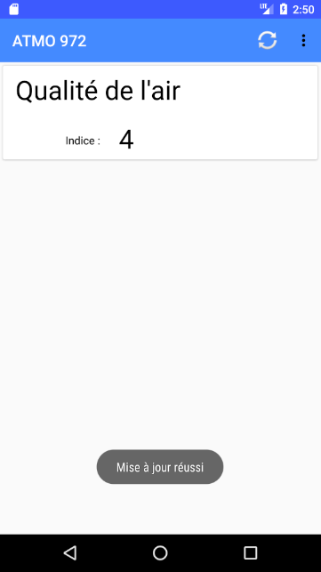
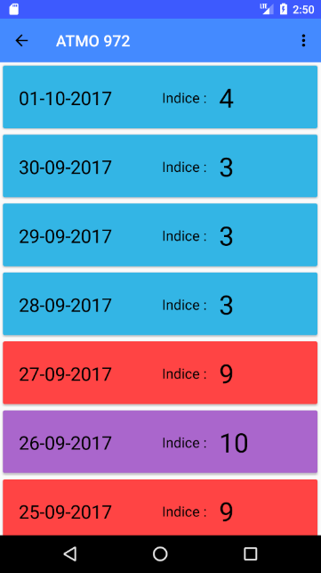

# ATMO972

this application displays the ATMO data of the Martinique region.

the data displayed is retrieved from the site : [MADININAIR](http://madininair.fr/)

### Prerequisites

Android SDK > version 15

### Installing

For the moment the application is not available on the Play Store.
you can download the application from the folder [APK](APK)

### Permissions

* INTERNET : to receive data
* GEOlOCATION : to find station near your position

## Screenshots

## Built With

* [Android Studio](https://developer.android.com/studio/index.html) - Official IDE for Android
* [Opencsv](https://mvnrepository.com/artifact/com.opencsv/opencsv) - CSV parser library
* [MPAndroidChart](https://github.com/PhilJay/MPAndroidChart) - Chart view / Graph view library

## Authors

* **Erwan ANGOT** - *amateur developer* - [Linkedin](https://www.linkedin.com/in/erwan-angot-16a08399/)

## License

This project is licensed under the MIT License - see the [LICENSE.md](LICENSE.md) file for details
